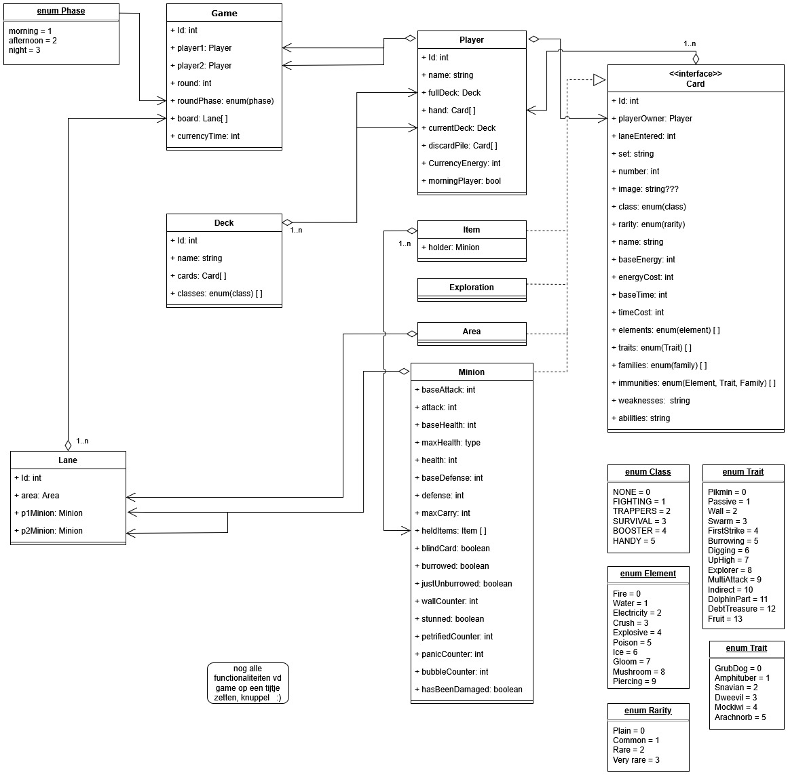

# Pikcards Web App Test

This repository will be used to setup a test application in TypeScript using Bun for Pikcards to prepare for migration to a web application.

## Setup Guide
Install the latest version of [Bun](https://bun.com) and clone this repository to your system, then simply:
```bash
bun install
bun run dev
```

## Plan
Backend with CLI with the following features implemented:
  - 10 cards
  - 2 players
  - Deck shuffling
  - Switching player controls
  - Draw cards to player "hand"
  - Play cards in "lanes"
  - Advance to next round

### Future Test Plans:
- Implement fighting into the backend CLI
- Begin frontend development

## UML
The project will reference the following class diagram, developed by [Apricone](https://github.com/Apricone):


